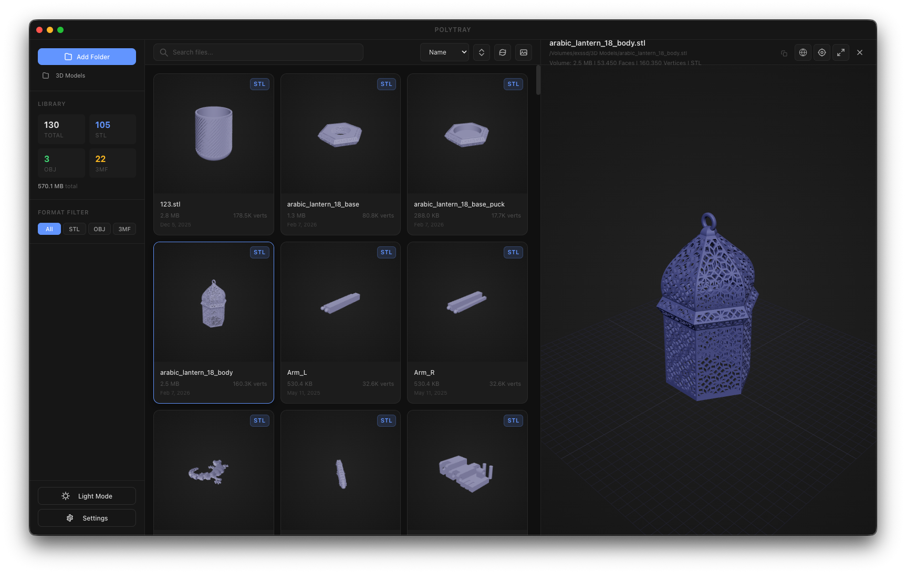

#  Polytray

**Polytray** is a fast, local 3D file organizer designed to help you scan, index, search, and preview your `.obj`, `.stl`, and `.3mf` files effortlessly.

## 🚀 Features

- **Local File Scanning**: Quickly scan folders to index 3D models without relying on cloud services.
- **Hardware-Accelerated Preview**: Built-in 3D viewer powered by Three.js to inspect models (includes wireframe mode, auto-centering, and smart orientation).
- **Multi-Model Support**: Automatic sub-model extraction and viewport zooming for complex `.3mf` build plates.
- **Fast Search & Filtering**: Instantly search your library by name, sort by face/vertex counts, or filter by format (`STL`, `OBJ`, `3MF`).
- **Auto-Generated Thumbnails**: Visual grid with automatically generated thumbnails for your 3D assets.
- **Offline & Private**: Everything is stored securely in your local SQLite database.

## 📸 Screenshots



## 💻 Usage

1. **Launch Polytray**: Open the application.
2. **Add Folders**: Click **Add Folder** in the sidebar to select directories containing your 3D models.
3. **Browse & Search**: Use the search bar to find specific files, or use the format filters (`STL`, `OBJ`, `3MF`) to narrow down the view.
4. **Preview**: Click on any file card in the grid to open the 3D preview panel. You can easily copy the absolute file path, toggle wireframes, and inspect metrics.
5. **Settings**: Use the settings menu to toggle Dark/Light mode, adjust grid sizing, and tweak auto-scanning behaviors.

## 🛠️ Development Instructions

Polytray is built using **Electron**, **React**, **Vite**, **Better-SQLite3**, and **Three.js**.

### Prerequisites

- [Node.js](https://nodejs.org/) (v20+ recommended)
- `npm`

### Setup

Clone the repository and install dependencies:

```bash
git clone https://github.com/cybermaak/polytray.git
cd polytray
npm install
```

### Running Locally

Start the development server with hot-module reloading:

```bash
npm run dev
```

_(Note: The app will run `tsc` typechecking before building the production assets, but it runs un-compiled TypeScript directly during `dev` via `electron-vite`.)_

### Testing

Run the comprehensive end-to-end test suite (using Playwright):

```bash
npm run test:e2e
```

_This command auto-generates test fixtures (`.obj`, `.stl`) so you don't need real 3D models to verify the UI._

### Building for Production

Compile and package the application for your operating system:

```bash
# Build the JS bundles for production
npm run build

# Package for macOS (requires Mac environment)
npm run build:mac

# Package for Windows
npm run build:win

# Package for Linux (AppImage)
npm run build:linux

# Package for all supported platforms
npm run build:all
```
