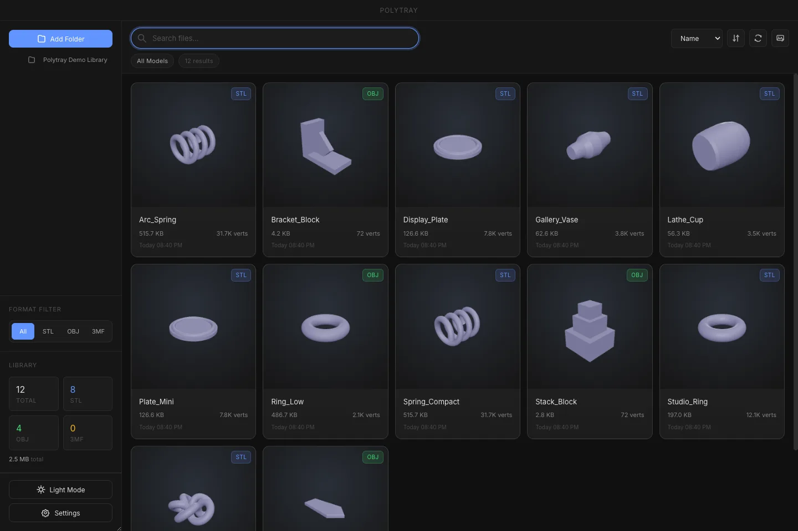
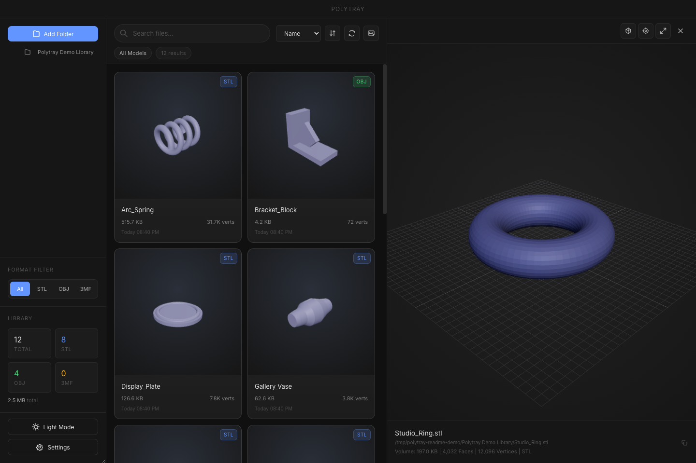

<p align="center">
  
</p>

# Polytray

> Local-first desktop organizer for large `.stl`, `.obj`, and `.3mf` libraries.
> Scan folders, generate thumbnails, search fast, and inspect models — without sending your files to the cloud.

<p align="center">
  <a href="https://github.com/cybermaak/polytray/releases/latest"><strong>⬇ Download Latest</strong></a>
  &nbsp;·&nbsp;
  <a href="https://github.com/cybermaak/polytray/releases">Release Notes</a>
  &nbsp;·&nbsp;
  <a href="#development">Development</a>
</p>

[](https://github.com/cybermaak/polytray/releases)
[](https://github.com/cybermaak/polytray/actions)
[](LICENSE)

---

<p align="center">
  
</p>

---

## Features

- 🗂 **Fast local indexing** — background thumbnail generation over dense model folders, zero cloud dependency
- 🔍 **Search, sort & filter** — by name, vertex/face count, format, and folder scope
- 👁 **Interactive 3D preview** — responsive Three.js viewer for STL, OBJ, and 3MF including large multi-model files
- 🎨 **Customizable appearance** — separate accent, preview material, and thumbnail material colors with per-color reset
- 💻 **Desktop-native** — drag-out, reveal-in-Finder/Explorer, native context menus, light & dark themes
- 🔒 **Privacy-first** — fully local; no accounts, no telemetry, no cloud processing



## Getting Started

Download the latest release for your platform:

| Platform | Download |
|----------|----------|
| **macOS** | [`.dmg`](https://github.com/cybermaak/polytray/releases/latest) |
| **Windows** | [`.exe` installer](https://github.com/cybermaak/polytray/releases/latest) |
| **Linux** | [`.AppImage`](https://github.com/cybermaak/polytray/releases/latest) |

See the [release notes](https://github.com/cybermaak/polytray/releases) for version history and changelogs.

## How It Works

1. **Add folders** — point Polytray at one or more directories from the sidebar.
2. **Index** — models are scanned, indexed, and thumbnails generate in the background.
3. **Browse** — narrow the library with folder scope, search, sort, and format filters.
4. **Preview** — click any card to inspect the mesh, toggle wireframe, and orbit the camera.
5. **Use** — drag the source file into your slicer or reveal it in the OS file manager.

## Development

Built with **Electron 34**, **React 19**, **Vite**, **Better-SQLite3**, and **Three.js**.

### Setup

```bash
git clone https://github.com/cybermaak/polytray.git
cd polytray
npm install
```

### Commands

```bash
npm run dev            # Electron + Vite dev mode
npm run build          # typecheck + production build
npm run test:product   # unit tests + Playwright E2E
npm run build:mac      # package for macOS
npm run build:win      # package for Windows
npm run build:linux    # package for Linux
```

### README media

```bash
npx tsx scripts/capture-readme-media.ts   # regenerate screenshot + demo from live app
```

## Status

| | |
|-|-|
| **Formats** | STL · OBJ · 3MF |
| **Storage** | local SQLite index, local thumbnail cache, renderer-owned settings |
| **Privacy** | local-first — no cloud, no telemetry |
| **Release** | GitHub Actions builds platform artifacts from tagged releases |

## License

[MIT](LICENSE)
