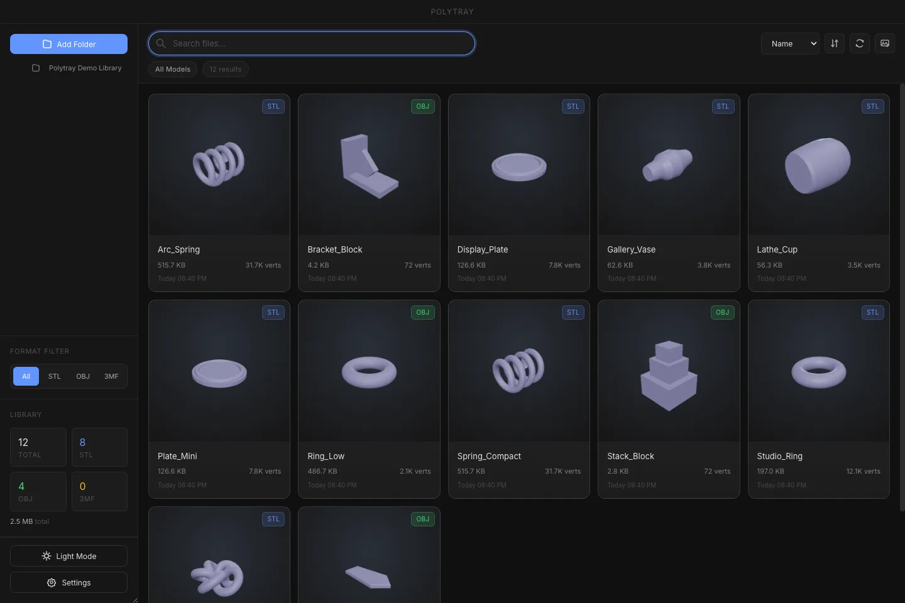
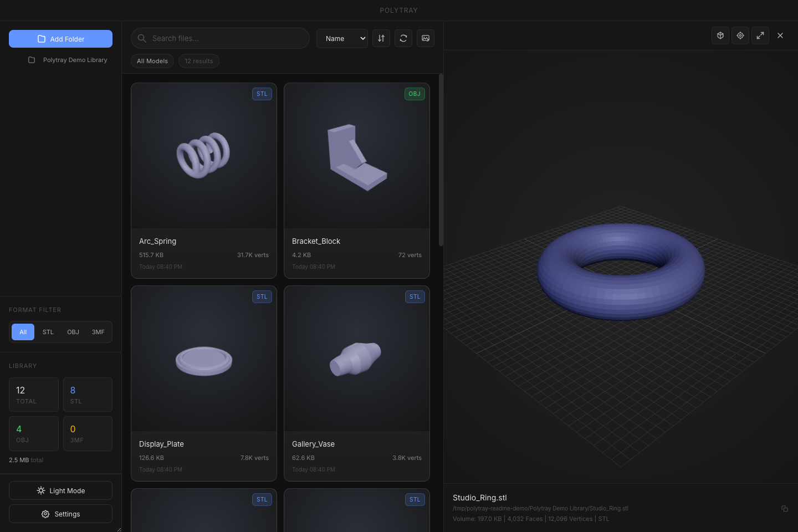

<p align="center">
  
</p>

# Polytray

> Local-first desktop organizer for large `.stl`, `.obj`, and `.3mf` libraries.
> Scan folders, generate thumbnails, search fast, and inspect models — without sending your files to the cloud.

<p align="center">
  <a href="https://github.com/cybermaak/polytray/releases/latest"><strong>⬇ Download Latest</strong></a>
  &nbsp;·&nbsp;
  <a href="https://github.com/cybermaak/polytray/releases">Release Notes</a>
  &nbsp;·&nbsp;
  <a href="#development">Development</a>
</p>

[](https://github.com/cybermaak/polytray/releases)
[](https://github.com/cybermaak/polytray/actions)
[](LICENSE)

---

<p align="center">
  
</p>

---

## Features

- 🗂 **Fast local indexing** — background thumbnail generation over dense model folders, zero cloud dependency
- 🔍 **Search, sort & filter** — by name, vertex/face count, format, and folder scope
- 🧭 **Collections and comparison** — tag and annotate models, group them into virtual collections, and compare selected models
- 📦 **Archive browsing** — browse supported models inside ZIP files and preview a chosen member without manually unpacking the archive
- 👁 **Interactive 3D preview** — responsive Three.js viewer for STL, OBJ, and 3MF including large multi-model files
- ⚙️ **Background job controls** — monitor scans and thumbnail work, pause or cancel active work, and retry reported failures
- 💾 **Metadata backup** — export and preview imports of tags, notes, collections, and other supported metadata
- 🖨️ **Slicer handoff** — choose a local slicer and explicitly open a selected model or archive member
- 🎨 **Customizable appearance** — separate accent, preview material, and thumbnail material colors with per-color reset
- 💻 **Desktop-native** — drag-out, reveal-in-Finder/Explorer, native context menus, light & dark themes
- 🔒 **Privacy-first** — fully local; no accounts, no telemetry, no cloud processing



## Getting Started

Download the latest release for your platform:

| Platform | Download | Notes |
|----------|----------|-------|
| **macOS** | [`.dmg`](https://github.com/cybermaak/polytray/releases/latest) | ✅ Signed & notarized by Apple — opens without Gatekeeper warnings |
| **Windows** | [`.exe` installer](https://github.com/cybermaak/polytray/releases/latest) | — |
| **Linux** | [`.AppImage`](https://github.com/cybermaak/polytray/releases/latest) | — |

See the [release notes](https://github.com/cybermaak/polytray/releases) for version history and changelogs.

## How It Works

1. **Add folders** — point Polytray at one or more directories from the sidebar.
2. **Scan** — discovered models are indexed in batches while thumbnails and metadata finish in the background. Use the background-work panel to see separate progress and control active jobs.
3. **Browse and organize** — search, sort, and filter by folder or format; add tags and notes; create virtual collections; or select models to compare.
4. **Preview** — open a model or ZIP summary, choose an archive member, and inspect the mesh, dimensions, part thumbnails, and viewer controls.
5. **Hand off** — drag a source file out, reveal it in the OS file manager, or use the configured local slicer action for an explicitly selected model.

## Library workflows

### Scans and offline folders

Pause or resume a scan from the background-work panel. Cancelling keeps records already indexed and does not remove files merely because an incomplete scan did not reach them. If a library folder is unavailable, Polytray retains its indexed records; reconnect the folder and rescan it to reconcile changes.

### Measurements and archives

ZIP cards open an archive preview where you can select a contained model without unpacking the whole archive. File size is shown separately from dimensions. 3MF dimensions use the source build's declared units and transforms and are shown in millimeters; STL and OBJ dimensions remain in model units because those formats do not guarantee millimeters.

### Metadata backup and restore

Export creates a metadata backup; it does not include source models or thumbnail files. Import first shows a preview. The default merge combines tags and collection membership, fills blank notes and default print status, and reports conflicting non-empty values for review. Paths that are not currently indexed remain pending so their annotations can be matched after the appropriate folder is scanned. Restoring folder settings does not start scanning or watching automatically. If recovery data cannot be applied, Polytray keeps the recovery state visible instead of treating the restore as complete.

## Development

Built with **Electron 34**, **React 19**, **Vite**, **Better-SQLite3**, and **Three.js**.

### Setup

```bash
git clone https://github.com/cybermaak/polytray.git
cd polytray
npm install
```

### Commands

```bash
npm run dev            # Electron + Vite dev mode
npm run build          # typecheck + production build
npm run test:product   # unit tests + Playwright E2E
npm run build:mac      # package for macOS
npm run build:win      # package for Windows
npm run build:linux    # package for Linux
```

### README media

```bash
npx tsx scripts/capture-readme-media.ts   # regenerate screenshot + demo from live app
```

## Status

| | |
|-|-|
| **Formats** | STL · OBJ · 3MF |
| **Storage** | local SQLite index, local thumbnail cache, renderer-owned settings |
| **Privacy** | local-first — no cloud, no telemetry |
| **Release** | GitHub Actions builds platform artifacts from tagged releases |

## License

[MIT](LICENSE)
