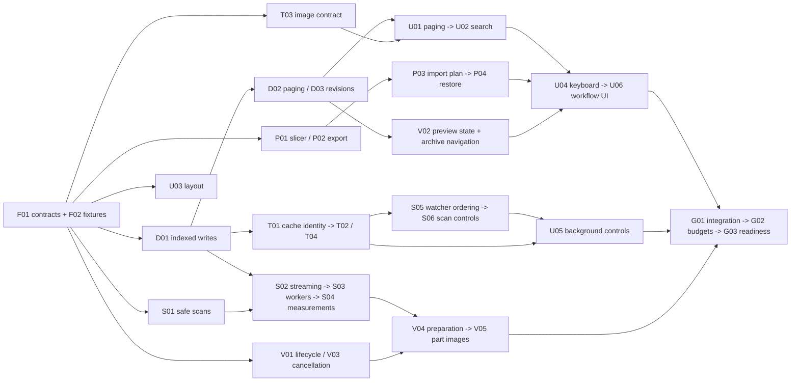

# Performance, responsiveness, and product execution plan

Date: 2026-09-26. Source baseline: `0cbe3c3`, with the user's existing uncommitted documentation/media work preserved.

**Status: execution authorized.** The user approved concurrent Luna agents at medium reasoning in isolated worktrees, coordinator review/integration into local main, and commits. Pushing to `origin/main` still requires explicit user permission. No release or external publication is authorized.

## How to use this plan

Start with the [task tracker](2026-09-26-performance-ux/tracker.md). Each task links to a specification containing dependencies, permitted files, implementation steps, regression cases, and completion evidence. Read the [shared contracts](2026-09-26-performance-ux/contracts.md) before implementing a task. Use the [handoff template](2026-09-26-performance-ux/handoff-template.md) to report work.

There are **33 tasks in six implementation workstreams, plus foundation and validation work**. Tasks within a workstream have one active owner. Different workstreams can run concurrently after their prerequisites are complete. Task dependencies are integration dependencies: a producer must be integrated and verified before a consumer is marked ready.

## Outcomes

1. An unavailable drive, unreadable subtree, corrupt archive, cancelled scan, or scan/watch race cannot silently erase library annotations.
2. Every matching model is reachable, including records after the first page and collection members outside it. Archive summaries and result counts remain correct across pages.
3. Large folder queries, scanning, thumbnails, and preview preparation keep the app responsive. An idle preview stops drawing.
4. Thumbnail refresh, settings changes, watcher additions, preview errors, search clearing, and narrow-window layouts behave predictably.
5. Keyboard navigation, useful background-work controls, trustworthy measurements, slicer handoff, and recoverable metadata export/import complete the requested product improvements.
6. Repeatable product tests and recorded performance evidence demonstrate the outcomes.

## Approach and trade-offs

**Chosen: independent subsystem workstreams with a small shared-contract foundation.** It gives each implementer bounded ownership while allowing data, scanning, thumbnail, viewer, UI, and workflow work to overlap. Central wiring changes are applied by one coordinator, not independently by every worker.

A fully serial fix list would reduce coordination but unnecessarily delay independent fixes. A broad rewrite into one new background runtime would increase migration risk and obscure the individual regressions. This plan retains the existing SQLite, watcher utility process, format strategy, and hidden-renderer approach; it introduces isolation only where cancellation or CPU work requires it.

The product defaults in `contracts.md` are the approved implementation defaults, not existing behavior or measured guarantees. They remove ambiguity for later implementers. Changing a default requires updating its contract, dependent task specifications, and tests before dispatch.

## Audit basis and limitations

The review used source inspection, a production build, 33 focused unit tests, and isolated Electron/macOS reproductions with temporary libraries. No user library was used for destructive tests. The knowledge-graph tools were unavailable, so findings used direct source evidence; no graph completeness claim is made.

| Observation | Recorded baseline |
| --- | --- |
| First-page truncation | 600 indexed files; 500 returned/displayed; a collection containing file 600 appeared empty |
| Folder query, 1k / 10k / 50k rows | Three-run medians approximately 25 / 324 / 1,950 ms |
| Unscoped query, same sizes | Approximately 3.7 / 12.9 / 16.3 ms |
| Untouched cube preview | Approximately 120 WebGL draw calls in one second; draw calls are not frame counts |
| Minimum window | At 900 x 600, sidebar plus preview left the browsing content width at zero |
| Missing root rescan | The indexed row, including its annotations, was deleted |
| Thumbnail arrival | A data URL was passed back into a path-only read API; visible cards stayed blank |
| Refresh / cache-hit / watcher thumbnail paths | Stale color output, a resolved path to a deleted PNG, and a new watched file marked thumbnail-failed were reproduced |
| Preview state | Tag editing recreated the canvas; a failed load hid the error message |
| Measurement fixture | A build transform doubled a 3MF dimension in preview while indexed dimensions stayed unchanged |

The 50k query measurements and 2M-triangle orientation probe are synthetic diagnostics, not a production workload census. Full product E2E and Windows/Linux validation were not run during the audit. Real large 3MF behavior still needs measurement. Scratch evidence under `.agent-tmp/perf-ux-review/` is optional local context; tasks must generate their own portable fixtures and cannot depend on that ignored directory.

## Workstreams and ownership

| Stream | Responsibility | Task specs | Main exclusive production files |
| --- | --- | --- | --- |
| F | Contracts, seams, fixtures; coordinator | [Foundation](2026-09-26-performance-ux/foundation-data.md#f01---freeze-contracts-and-extract-the-preview-seam) | `src/shared/types.ts`, `src/preload/index.ts`, `src/renderer/globals.d.ts`, `src/main/index.ts`, build config, shared runtime validation/settings |
| D | Querying, schema, indexed-write repository, revisions | [Data](2026-09-26-performance-ux/foundation-data.md#d01---indexed-folder-membership-and-a-batched-write-repository) | `src/main/database.ts`, `src/main/fileIndexing.ts`, `src/main/ipc/files.ts`, new query/revision modules |
| S | Safe scans, metadata extraction, watchers, scan jobs | [Scanning](2026-09-26-performance-ux/scanning.md) | `src/main/scanner.ts`, `src/main/ipc/scanning.ts`, `src/main/metadata.ts`, `src/main/watcher.ts`, `src/main/worker.ts`, `src/main/watcherLifecycle.ts` |
| T | Thumbnail cache, scheduler, image presentation | [Thumbnails](2026-09-26-performance-ux/thumbnails.md) | `src/main/thumbnails.ts`, `src/main/thumbnailJobScheduler.ts`, `src/main/thumbnailCacheLifecycle.ts`, `src/main/ipc/thumbnails.ts`, `src/renderer/lib/thumbnailRenderer.ts`; new shared image component |
| V | Viewer lifecycle, cancellation, preparation, part previews | [Preview](2026-09-26-performance-ux/preview.md) | `src/renderer/lib/viewer.ts`, preview strategies/workers/orientation/serialization, `src/renderer/components/PreviewPanel.tsx`; extracted preview broker and new preview renderer |
| U | Browse orchestration, search, layout, keyboard, integration UI | [Browsing](2026-09-26-performance-ux/browsing.md) | `src/renderer/App.tsx`, `FileGrid.tsx`, `Toolbar.tsx`, `Sidebar.tsx`, `ScanProgress.tsx`, `BatchActionsBar.tsx`, `ComparePanel.tsx`, `SettingsModal.tsx`, `styles.css` |
| P | Slicer and backup/restore services | [Product workflows](2026-09-26-performance-ux/product.md) | New `src/main/slicerHandoff.ts`, backup/restore modules, dedicated IPC modules and pure shared backup rules |
| G | Integrated evidence, budgets, documentation | [Validation](2026-09-26-performance-ux/validation.md) | New cross-stream E2E/performance tests; docs after implementations stabilize |

File names in the table are repository-relative. New paths in task specs are intentional; they need not exist yet. Paths must be rechecked against the executing checkout before editing.

### Shared-file rules

- One owner edits a file at a time. Workers do not revert unrelated edits or touch another stream's files to make their own test pass.
- The coordinator alone updates this plan, the tracker, common IPC exports, preload root, main registration, settings schema, build configuration, and existing shared test helpers. Stream owners submit exact, small wiring requests in their handoffs; the coordinator applies and validates them before marking the task done.
- D alone edits `database.ts` and `fileIndexing.ts`, including schema changes requested by another stream. Reserve migration 5 for D01 and migration 6 for P04; verify the current database version at execution time and append, never overwrite/reorder a migration if the baseline moved.
- F01 moves preview parsing out of thumbnail-owned files before T and V work concurrently. S04 transfers the DOM-free fast 3MF parser into a shared location; V04 waits for that transfer. Other parser/viewer files stay V-owned.
- T03 creates a shared thumbnail component. U installs it into grid/compare surfaces, and V installs it into its owned surface if needed. Neither T nor V edits U's files.
- U owns layout CSS. V requests named class/prop changes rather than changing `styles.css`. P provides services and typed presentation data; U06 owns the user-facing workflow integration.
- New tests use stream-specific filenames. Only F/G edit existing common fixtures and the monolithic `app.e2e.ts`; individual streams add separate test files. A task needing an existing domain unit test may edit it only if listed in its spec.
- Parallel execution should use isolated worktrees when authorized. Do not run Node/Electron native rebuilds concurrently in one dependency installation. With one shared checkout, use file ownership plus a single test/build lane; writes to native dependencies and generated build output are serialized.

## Dependency graph and dispatch

The tracker is the complete dependency source. This diagram shows the important cross-stream dependencies, not every sequential task.

Suggested scheduling, subject to actual dependencies:

1. **Foundation:** F01 and F02 may run concurrently; coordinator integrates both.
2. **First parallel set:** D01, S01, and V01/V03. With more workers, T03, U03, P01, and P02 are independent options. With three worker slots, keep a fourth slot for coordination and assign the next eligible task when a slot opens.
3. **Core repair:** D02/D03; S02/S03/S05; T01/T02/T04; V02/V03; U01/U02. Do not wait for an entire stream if the required producer task is already done.
4. **Remaining responsiveness and product work:** S04/S06, V04/V05, U04/U05, P03/P04, then U06. Product services can be built early, but their UI is wired after the core contracts settle.
5. **Integration and readiness:** G01-G03. These validate completed work; they are not a substitute for each task's own tests.

Useful checkpoints are: data-loss protection (S01); complete browsing (D01-D03/U01-U02); reliable thumbnails (T01-T04/S05); responsive preview (V01-V05/S04); usable workflows (U03-U06/P01-P04); final evidence (G01-G03). Checkpoints are review points, not permission to publish.

## Audit-to-task coverage

| Finding / feedback | Owning tasks |
| --- | --- |
| Missing/unreadable folder deletes annotations | S01, S02, S05, G01 |
| 500-item cap, incorrect totals, empty collections | D02, U01, G01 |
| Folder filtering/sorting blocks main; name collation index mismatch | D01, D02, G02 |
| Repeated stats/directory queries and tree rebuilds | D03, U02 |
| Thumbnail path/data-URL confusion | T03, U01 |
| Stale color/quality refresh, deleted-cache promise reuse, cache version reset | T01, T02 |
| New watcher file cannot obtain a thumbnail | S05, T01 |
| Thumbnail retries/progress/queue lifecycle | T04, U05 |
| Continuous idle drawing and visible-window throttling | V01, G02 |
| Tag updates reconstruct WebGL/camera | V02 |
| Loading errors invisible; stale preview work | V02, V03, V04 |
| 3MF cancellation and thumbnail competition | F01, V03 |
| Main-thread orientation and monolithic mesh build | V04, G02 |
| Full-size, blocking per-part canvas images | V05 |
| Slow first scan results, main-process extraction, repeated DB work | D01, S02, S03, U05, G02 |
| Narrow-window browsing disappears | U03 |
| Search chip/input/debounce disagreement | U02 |
| Actionable progress, pause/cancel/retry, watch setting respected | S06, T04, U05 |
| Keyboard browsing, focus, dialog behavior | U04, V02, U06 |
| Open in slicer, including archived entries | P01, U06 |
| Incorrect 3MF dimensions/units and file-size label | S04, V04, U06 |
| Backup/recovery across SQLite and localStorage | P02, P03, P04, U06 |
| Weak performance gates and misleading runtime documentation | F02, G01, G02, G03 |

Thumbnail quality settings, stable card memoization, archive page boundaries, and selection consistency are included as necessary integration details of those fixes. New duplicate detection, cloud sync, print-history workflows, a full redesign, and promotional-site work are outside this plan.

## Definition of done

A task is done only when its regression initially failed for the intended reason, the implementation passes the specified checks, its in-scope wiring is integrated, the acceptance criteria are demonstrated, and its handoff names evidence and limitations. A producer service/component may finish before a separately tracked consumer integrates it; that does not make the later user journey complete. Use the smallest meaningful checks; do not add tests that merely mirror implementation. Follow the repo's test-first rule for product changes.

### Dispatch instructions for an implementer

Give the implementer one task ID and its complete specification, the applicable contract sections, dependency handoffs, exact owned files, checkout, and test lane. Ask it to:

1. Read `AGENTS.md` and `DEV_CONTEXT.md`, check local changes, and verify dependency interfaces in source. If graph tools are available, confirm project/generation and use the required coverage checks; otherwise state source fallback.
2. Implement only the assigned task. Other owners are active: preserve their edits and submit narrow wiring requests rather than modifying their files.
3. Write the stated failing regression, implement the smallest change satisfying the fixed contract, and run the assigned verification. Do not substitute a weaker assertion or widen permissions to get a pass.
4. Report any contract contradiction, missing prerequisite, or acceptance failure with the exact evidence. Do not choose a different architecture, expand scope, or mark a task complete to work around it.
5. Return a completed handoff with test results, ownership requests, and remaining limits. Commit the assigned changes after verification; the coordinator performs spec/quality review and updates the tracker. Do not push to origin/main or publish.

Standard verification labels used in task specs:

- **Type:** `npm run typecheck`.
- **Unit:** `npm run test:product:unit`, with the native module first prepared for Node if required. Targeted tests may be used while iterating; record exact commands/files.
- **Build:** `npm run build`.
- **Product:** `npm run test:product`. Keep its existing order: Node native rebuild, product units, Electron native rebuild, then E2E.
- **Repo:** `npm run test:repo` for documentation/repo-contract changes where applicable.

Do not run a targeted Node SQLite test against an Electron-built native module and interpret an ABI error as a product regression. Use `tests/support/helpers/electronLaunch.ts` for launch environments. Tests use temporary userData and generated fixtures, and must not start slicers or modify the user's real library. Use synchronous `waitForFunction` predicates, event assertions, or `expect.poll`; do not use async `waitForFunction` predicates or fixed sleeps as success evidence.

Final readiness requires Build + Product on the integrated result, recorded platform coverage, and the performance evidence in G02. Task and integration commits are authorized; releases and pushes to origin/main are not authorized. If platform access is unavailable, record the outstanding validation and leave the relevant task incomplete rather than claiming a cross-platform pass.
